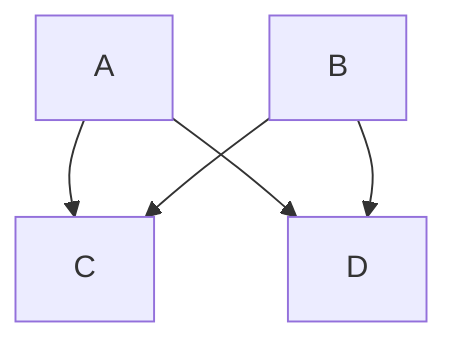

# What is Mermaid?

[Mermaid](1) allows us to use simple markup code to create complex **software engineering diagrams**, such as flowchart, sequence diagrams and class diagrams, that are easily editable. For more details see https://mermaid.js.org.

# Goal

To allow us to use **mermaid diagrams** in our **github pages**.

(Mermaid actually already works for .md files in your Github repos, but is not yet installed by default for Github Pages.)

# Copy post.html

The first step will be to make a copy of your theme's `_layouts/post.html` file into your blog's repo. Create a `_layouts ` folder if you don't already have one in your blog's repo and make a copy of the `post.html` file there.

In my case (using the Minima theme) the `post.html` file it's located at <https://github.com/jekyll/minima/blob/2.5-stable/_layouts/post.html>. Since Github Pages currently uses Minima version 2.5 I needed to select the `2.5-stable` branch and use the file there.

# Install Mermaid

Edit your `_layouts/post.html` to include:

```html
<script type="module">
  import mermaid from 'https://cdn.jsdelivr.net/npm/mermaid@10.0.2/+esm'
  mermaid.initialize({startOnLoad:true,theme:'neutral'})
  await mermaid.run({querySelector:'code.language-mermaid'})
</script>
```

You can set the [Mermaid](1) theme by changing:
```js
theme:'neutral'
```
to the [Mermaid](1) theme of your choice e.g. `default`, `neutral`, `dark`, `forest` or `base`.

# Test Mermaid

In your `_posts`  folder you can create or edit a post. Surround your [Mermaid](1) diagram with three backticks, and the word [mermaid](1) after the first three backticks:

````

````

If the installation happened correctly the [Mermaid](1) markdown will be rendered as a diagram.

<figure>
  
  <figcaption>Mermaid Flowchart Example</figcaption>
</figure>

# Make it pretty

Edit your `_layouts/post.html` to include:

```css
<style>
code.language-mermaid {
  display: flex;
  justify-content: center;
}
pre:has(code.language-mermaid), code.language-mermaid {
  background-color: transparent;
}
.edgeLabel {
  font-size: 92%;
  opacity: .95;
  color: #111;
  padding: 0 3px;
}
.node rect {
  stroke: #214f78 !important;
}
.nodeLabel {
  color: #214f78 !important;
}
</style>
```

The Mermaid markdown should now transform to look like this:


<figcaption>Mermaid Flowchart Example</figcaption>

You can add or edit more CSS to customise the appearance as you like.

[1]: https://mermaid.js.org/